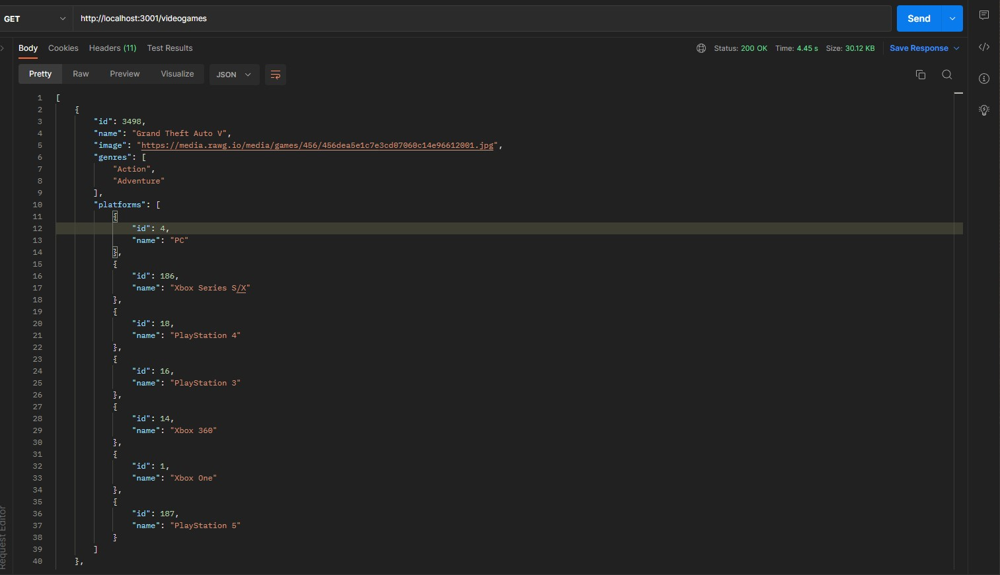
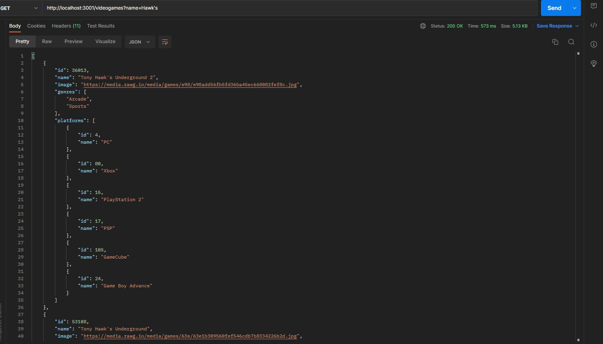
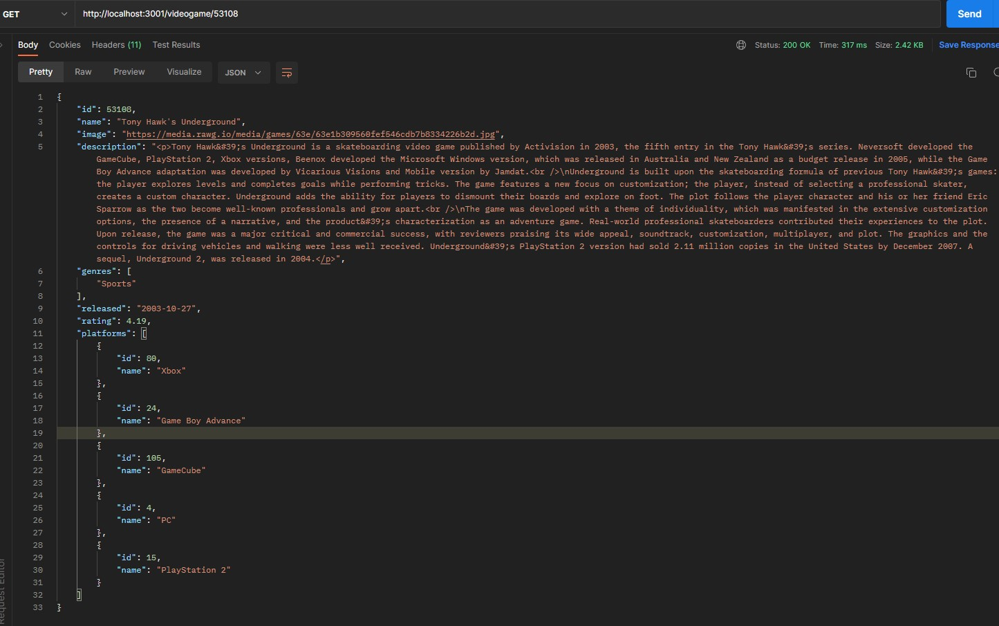
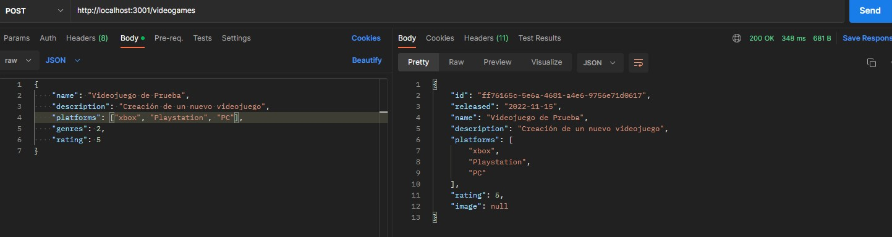
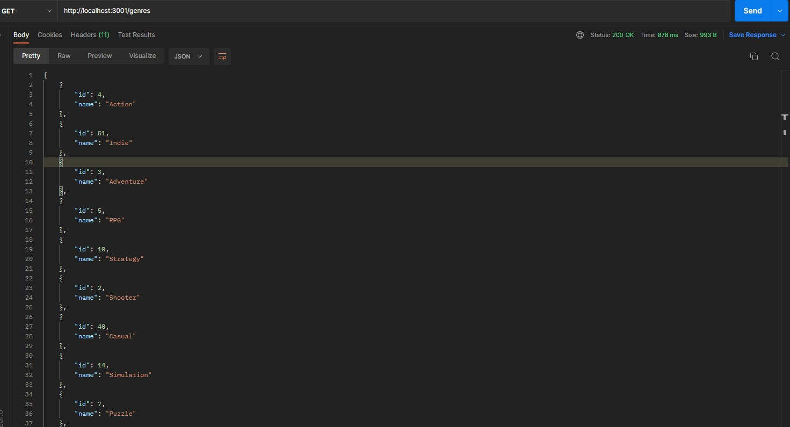

# Proyecto Backend.

## Desarrollo.

Aplicación donde se pueden ver los distintos videojuegos disponibles junto con información relevante de los mismos utilizando la API externa [rawg](https://rawg.io/apidocs). En la cual pueden conseguir las siguentes funciones.

- Listar todos los videojuegos.
- Buscar videjuegos por nombre.
- Buscar videjuegos por id.
- Listar todos los géneros de los videojuegos.
- Agregar nuevos videojuegos.

### Endpoints/Flags Utilizado:

- GET <https://api.rawg.io/api/games>
- GET <https://api.rawg.io/api/games?search={game}>
- GET <https://api.rawg.io/api/genres>
- GET <https://api.rawg.io/api/games/{id}>

#### Tecnologías Utilizadas.

- **Javascript.**
- **NodeJs.**
- **Express.**
- **Sequelize.** 
- **Postgres.**

## Backend

Se desarrollo un servidor con Node-Express con las siguientes rutas:

- __GET /videogames__:
  - Listado de todos los videojuegos.

  

    

  - Listado de los videojuegos que incluyan la palabra ingresada como query parameter.

  

    
  

- __GET /videogame/{idVideogame}__:
  - Detalle de un videojuego en particular.

  

    
  

- __POST /videogames__:
  - Recibe los datos recolectados de la ruta de creación de videojuego por body.
  - Crear u unuevo videojuego en la base de datos, relacionado a sus géneros.

  

    
  

- __GET /genres__:
  - Obtiene los tipo de genero de la API de rawg y guardarlos en su propia base de datos y luego ya utilizarlos desde allí.

    

    
  

